<div align="center">
  <center><h1>Phy-Q as a measure for physical reasoning intelligence</h1></center>
</div>

<p align="center">
Cheng Xue*, Vimukthini Pinto*, Chathura Gamage*<br> Ekaterina Nikonova, Peng Zhang, Jochen Renz<br>
School of Computing<br>
The Australian National University<br>
Canberra, Australia<br>
{cheng.xue, vimukthini.inguruwattage, chathura.gamage}@anu.edu.au<br>
{ekaterina.nikonova, p.zhang, jochen.renz}@anu.edu.au
 </p>

<p align="justify">
Humans are well-versed in reasoning about the behaviors of physical objects and choosing actions accordingly to accomplish tasks, while it remains a major challenge for AI. To facilitate research addressing this problem, we propose a new testbed that requires an agent to reason about physical scenarios and take an action appropriately. Inspired by the physical knowledge acquired in infancy and the capabilities required for robots to operate in real-world environments, we identify 15 essential physical scenarios. We create a wide variety of distinct task templates, and we ensure all the task templates within the same scenario can be solved by using one specific strategic physical rule. By having such a design, we evaluate two distinct levels of generalization, namely the local generalization and the broad generalization. We conduct an extensive evaluation with human players, learning agents with varying input types and architectures, and heuristic agents with different strategies. Inspired by how human IQ is calculated, we define the physical reasoning quotient (Phy-Q score) that reflects the physical reasoning intelligence of an agent using the physical scenarios we considered. Our evaluation shows that 1) all agents are far below human performance, and 2) learning agents, even with good local generalization ability, struggle to learn the underlying physical reasoning rules and fail to generalize broadly. We encourage the development of intelligent agents that can reach the human level Phy-Q score.
 </p>
 
\* equal contribution

The research paper can be found here: https://www.nature.com/articles/s42256-022-00583-4

DOI of the repository: [](https://zenodo.org/badge/latestdoi/400728416)

---
#### Table of contents
1. [Physical Scenarios in Phy-Q](#Scenarios)
2. [Phy-Q in Angry Birds](#Phy-Q)
3. [Generating Tasks](#Generating-Tasks)
	1. [Task Generator](#Task-generator) 	
	2. [Tasks Generted for the Baseline Analysis](#Tasks-generated-for-baselines)
	3. [Creating Your Own Tasks](#Creating-Your-Own-Tasks)
4. [Baseline Agents](#BAF)
	1. [How to Run Heuristic Agents](#RHA)
	2. [How to Run Learning Agents](#RLA)
		1. [How to Run DQN and Deep Relational Baselines](#RLA)
		2. [How to Run Stable Baselines](#OLA)
	4. [How to Develop Your Own Agent](#ROA)
	5. [Outline of the Agent Code](#code)
5. [Framework](#Framework)
   1. [The Game Environment](#Env)
   2. [Symbolic Representation Data Structure](#SymbolicRepresentation)
   3. [Communication Protocols](#Protocol)
6. [Play Data](#PlayData)
---

---


## 1. Physical Scenarios in Phy-Q 
<a name="Scenarios"/></a>
We consider 15 physical scenarios in Phy-Q benchmark. Firstly, we consider the basic physical scenarios associated with applying forces directly on the target objects, i.e., the effect of a single force and the effect of multiple forces. On top of simple forces application, we also include the scenarios associated with more complex motion including rolling, falling, sliding, and bouncing, which are inspired by the physical reasoning capabilities developed in human infancy. Furthermore, we define the objects' relative weight, the relative height, the relative width, the shape differences, and the stability scenarios, which require physical reasoning abilities infants acquire typically in a later stage. On the other hand, we also incorporate clearing path, adequate timing, and manoeuvring capabilities, and taking non-greedy actions, which are required to overcome challenges for robots to work safely and efficiently in physical environments. To sum up, the physical scenarios we consider and the corresponding physical rules that can use to achieve the goal of the associated tasks are:

   1. **Single force:** Some target objects can be destroyed with a single force.
   2. **Multiple forces:** Some target objects need multiple forces to destroy.
   3. **Rolling:** Circular objects can be rolled along a surface to a target.
   4. **Falling:** Objects can be fallen on to a target.
   5. **Sliding:** Non-circular objects can be slid along a surface to a target.
   6. **Bouncing:** Objects can be bounced off a surface to reach a target.
   7. **Relative weight:** Objects with correct weight need to be moved to reach a target.
   8. **Relative height:** Objects with correct height need to be moved to reach a target.
   9. **Relative width:** Objects with correct width or the opening with correct width should be selected to reach a target.
   10. **Shape difference:** Objects with correct shape need to be moved/destroyed to reach a target.
   11. **Non-greedy actions:** Actions need to be selected in the correct order based on physical consequences. The immediate action may be less effective in the short term but advantageous in long term. i.e., reach less targets in the short term to reach more targets later.
   12. **Structural analysis:** The correct target needs to be chosen to break the stability of a structure.
   13. **Clearing paths:** A path needs to be created before the target can be reached.
   14. **Adequate timing:** Correct actions need to be performed within time constraints.
   15. **Manoeuvring:** Powers of objects need to be activated correctly to reach a target.

## 2. Phy-Q in Angry Birds
<a name="Phy-Q"/></a>
Based on the above physical scenarios, we develop Phy-Q benchmark in Angry Birds. Phy-Q contains tasks from 75 task templates belonging to the fifteen scenarios. The goal of an agent is to destroy all the pigs (green-coloured objects) in the tasks by shooting a given number of birds from the slingshot. Shown below are fifteen example tasks in Phy-Q representing the fifteen scenarios and the solutions for those tasks.

| Task             |  Description |
:-------------------------:|:-----------
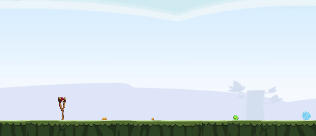 | 1. Single force: A single force is needed to be applied to the pig to destroy it by a direct bird shot.
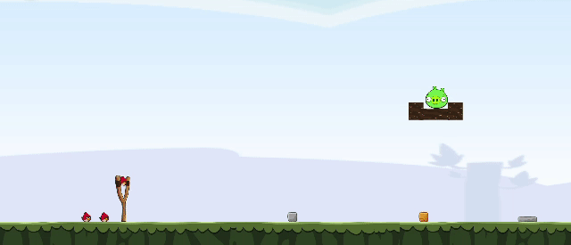 | 2. Multiple forces: Multiple forces are needed to be applied to destroy the pig by multiple bird shots.
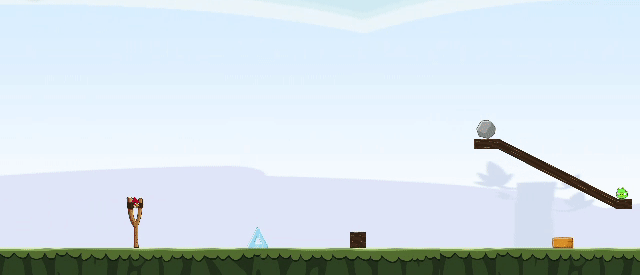 | 3. Rolling: The circular object is needed to be rolled onto the pig, which is unreachable for the bird from the slingshot, causing the pig to be destroyed.
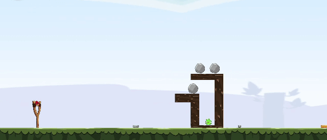 | 4. Falling: The circular object is needed to be fallen onto the pig causing the pig to be destroyed.
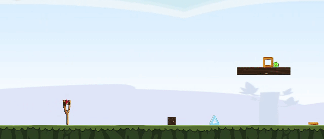 | 5. Sliding: The square object is needed to be slid to hit the pig, which is unreachable for the bird from the slingshot, causing the pig to be destroyed.
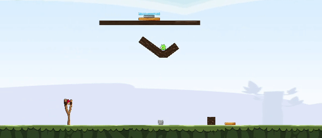 | 6. Bouncing: The bird is needed to be bounced off the platform (dark-brown object) to hit and destroy the pig.
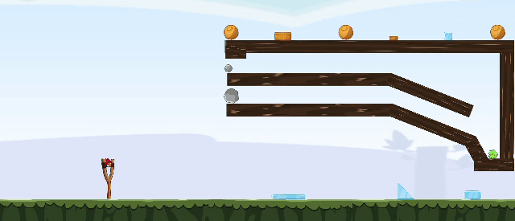 | 7. Relative weight: The small circular block is lighter than the big circular block. Out of the two blocks, the small circular block can only be rolled to reach the pig and destroy.
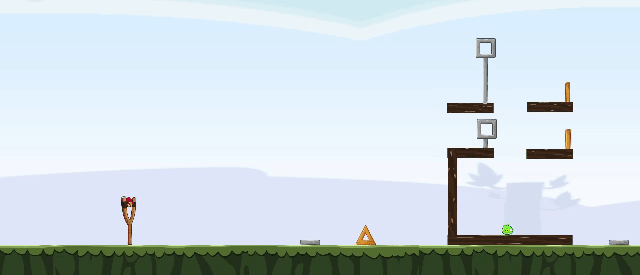 | 8. Relative height: The square block on top of the taller rectangular block will not fall through the gap due to the height of the rectangular block. Hence the square block on top of the shorter rectangular block needs to be toppled to fall through the gap and destroy the pig.
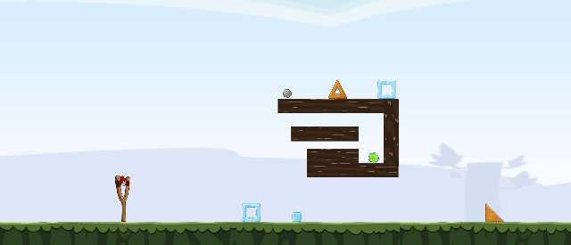 | 9. Relative width: The bird cannot go through the lower entrance which has a narrow opening. Hence the bird is needed to be shot to the upper entrance to reach the pig and destroy it.
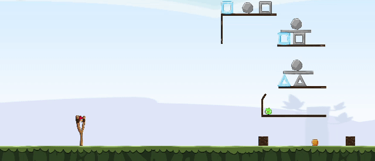 | 10. Shape difference: The circular block on two triangle blocks can be rolled down by breaking a one triangle block and the circular block on two square blocks cannot be rolled down by breaking a one square block. Hence, the triangle block needs to be destroyed to make the circular block roll and fall onto the pig causing the pig to be destroyed.
 | 11. Non-greedy actions: A greedy action tries to destroy the highest number of pigs in a single bird shot. If the two pigs resting on the circular block are destroyed, then the circular block will roll down and block the entrance to reach the below pig. Hence, the below pig is needed to be destroyed first and then the upper two pigs.
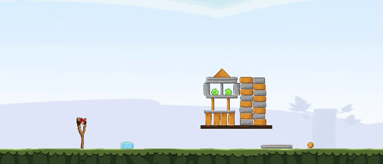 | 12. Structural analysis: The bird is needed to be shot at the weak point of the structure to break the stability and destroy the pigs. Shooting elsewhere does not destroy the two pigs with a single bird shot.
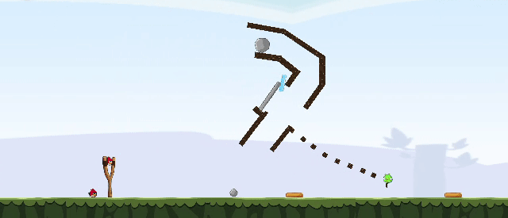 | 13. Clearing paths: First, the rectangle block is needed to be positioned correctly to open the path for the circular block to reach the pig. Then the circular block is needed to be rolled to destroy the pig.
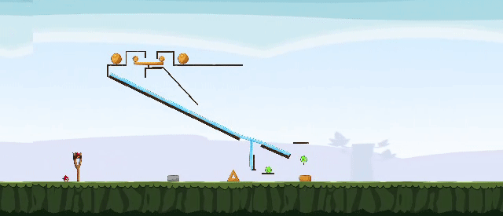 | 14. Adequate timing: First, the two circular objects are needed to be rolled to the ramp. Then, after the first circle passes the prop and before the second circle reaches the prop, the prop needs to be destroyed to make the second circle fall onto the lower pig.
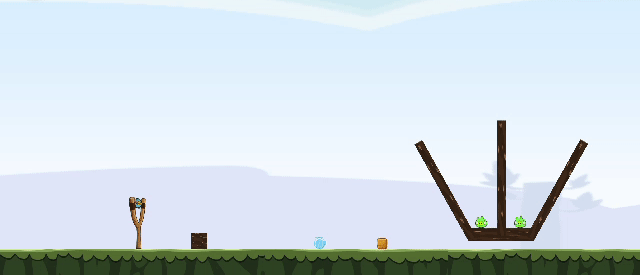 | 15. Manoeuvring: The blue bird splits into three other birds when it is tapped in the flight. The blue bird is needed to be tapped at the correct position to manoeuvre the birds to reach the two separated pigs.

Sceenshots of the 75 task templates are shown below. x.y represents the y<sup>th</sup> template of the x<sup>th</sup> scenario. The indexes of the scenarios are: 1. single force, 2. multiple forces, 3. rolling, 4. falling, 5. sliding, 6. bouncing, 7. relative weight, 8. relative height, 9. relative width, 10. shape difference, 11. non-greedy actions, 12. structural analysis, 13. clearing paths, 14. adequate timing, and 15. manoeuvring: 

<table align="center">
<tr>
	<td>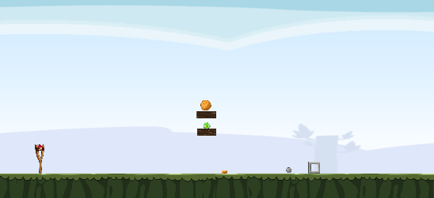</td>
	<td>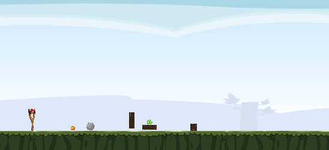</td>
	<td>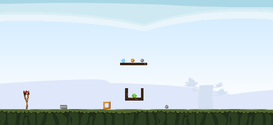</td>
</tr>
<tr align="center">
	<td> 1.1 </td>
	<td> 1.2 </td>
	<td> 1.3 </td>
</tr>
	
<tr>
	<td>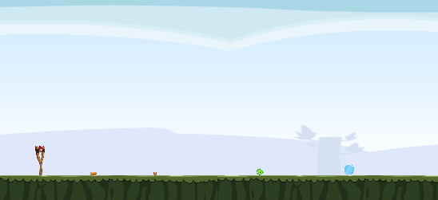</td>
	<td>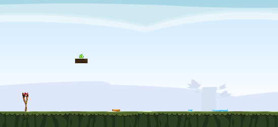</td>
	<td>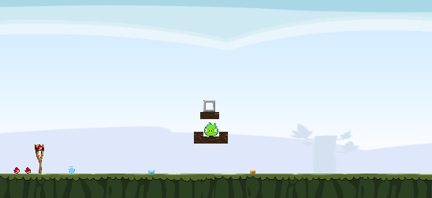</td>
</tr>
<tr align="center">
	<td> 1.4 </td>
	<td> 1.5 </td>
	<td> 2.1 </td>
</tr>
	
<tr>
	<td>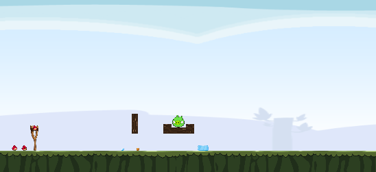</td>
	<td>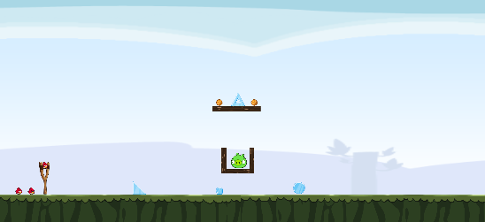</td>
	<td>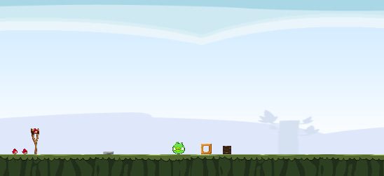</td>
</tr>
<tr align="center">
	<td> 2.2 </td>
	<td> 2.3 </td>
	<td> 2.4 </td>
</tr>
	
<tr>
	<td>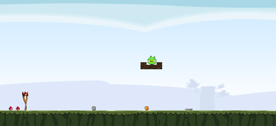</td>
	<td>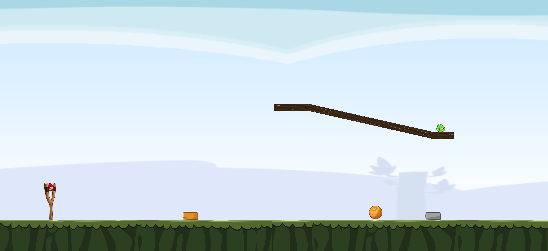</td>
	<td></td>
</tr>
<tr align="center">
	<td> 2.5 </td>
	<td> 3.1 </td>
	<td> 3.2 </td>
</tr>

<tr>
	<td>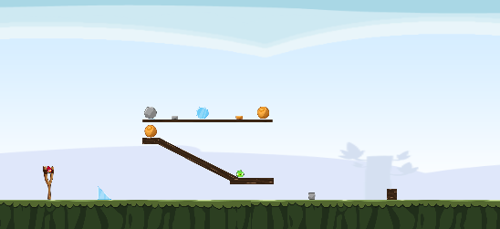</td>
	<td>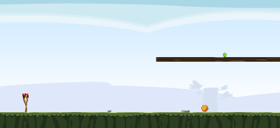</td>
	<td>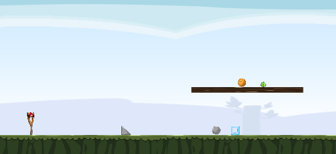</td>
</tr>
<tr align="center">
	<td> 3.3 </td>
	<td> 3.4 </td>
	<td> 3.5 </td>
</tr>
	
<tr>	
	<td>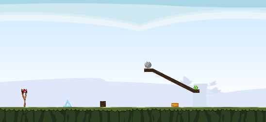</td>
	<td>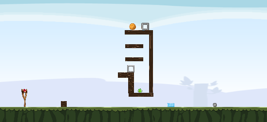</td>
	<td>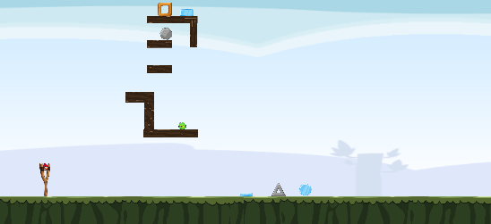</td>
</tr>
<tr align="center">
	<td> 3.6 </td>
	<td> 4.1 </td>
	<td> 4.2 </td>
</tr>	
	
<tr>
	<td>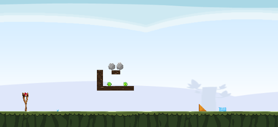</td>
	<td>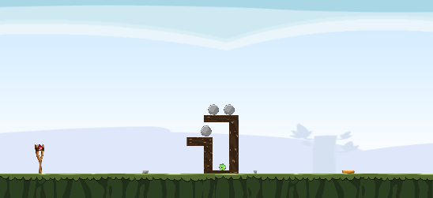</td>
	<td>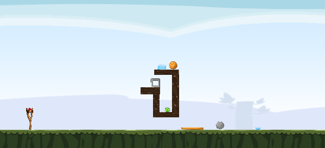</td>
</tr>
<tr align="center">
	<td> 4.3 </td>
	<td> 4.4 </td>
	<td> 4.5 </td>
</tr>
	
<tr>
	<td>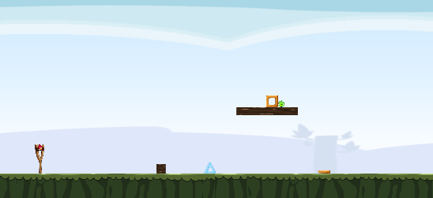</td>
	<td>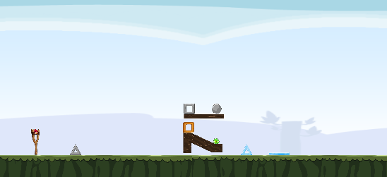</td>
	<td>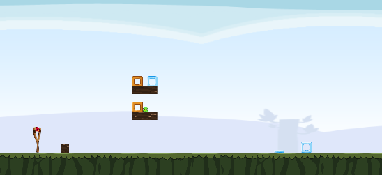</td>
</tr>
<tr align="center">
	<td> 5.1 </td>
	<td> 5.2 </td>
	<td> 5.3 </td>
</tr>

<tr>
	<td>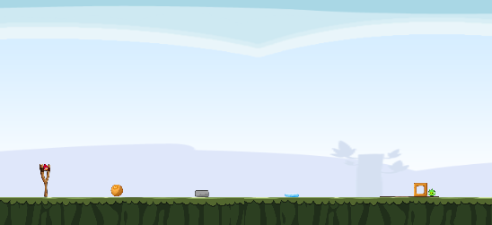</td>
	<td>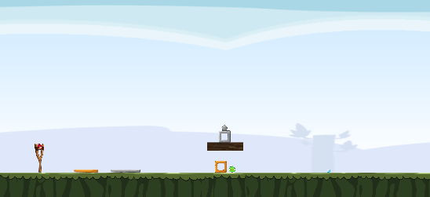</td>
	<td>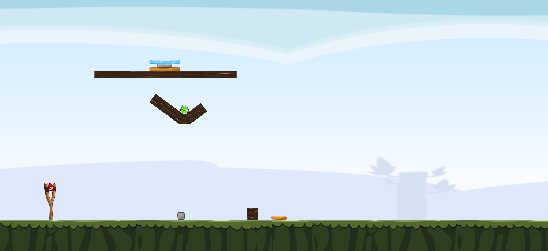</td>
</tr>
<tr align="center">
	<td> 5.4 </td>
	<td> 5.5 </td>
	<td> 6.1 </td>
</tr>
	
<tr>
	<td>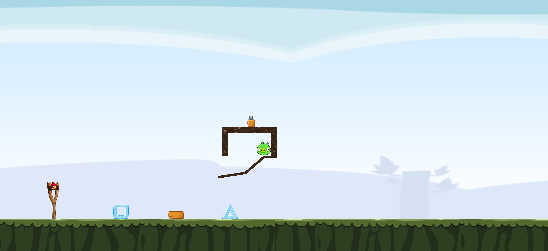</td>
	<td>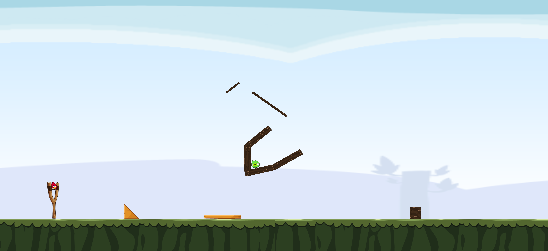</td>
	<td>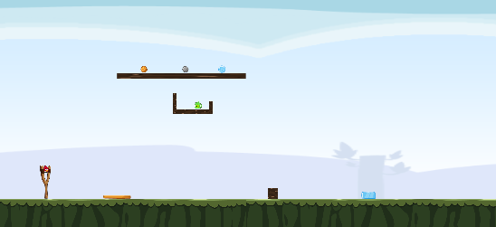</td>
</tr>
<tr align="center">
	<td> 6.2 </td>
	<td> 6.3 </td>
	<td> 6.4 </td>
</tr>	

<tr>
	<td>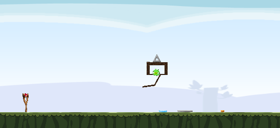</td>
	<td>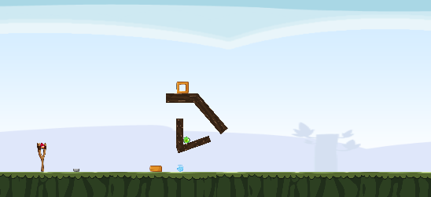</td>
	<td>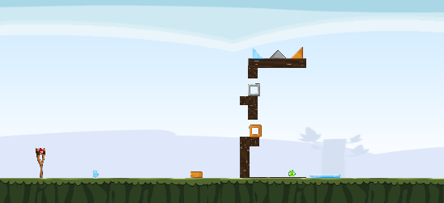</td>
</tr>
<tr align="center">
	<td> 6.5 </td>
	<td> 6.6 </td>
	<td> 7.1 </td>
</tr>	
	
<tr>
	<td>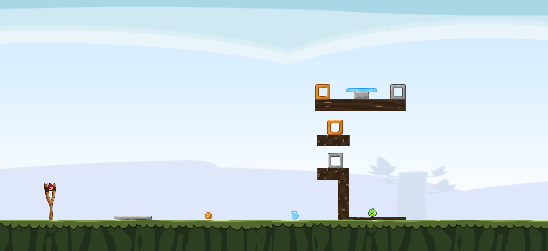</td>
	<td>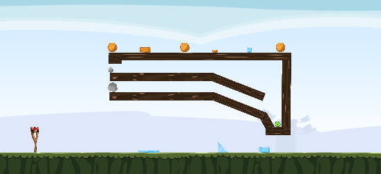</td>
	<td>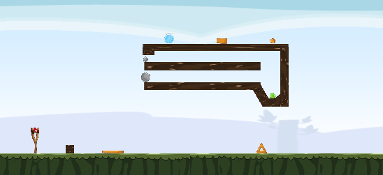</td>
</tr>
<tr align="center">
	<td> 7.2 </td>
	<td> 7.3 </td>
	<td> 7.4 </td>
</tr>
	
<tr>
	<td></td>
	<td>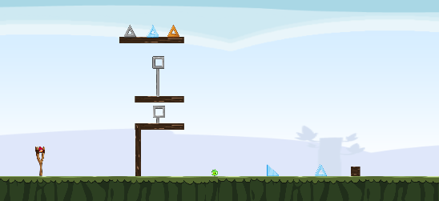</td>
	<td></td>
</tr>
<tr align="center">
	<td> 7.5 </td>
	<td> 8.1 </td>
	<td> 8.2 </td>
</tr>

<tr>
	<td></td>
	<td></td>
	<td></td>
</tr>
<tr align="center">
	<td> 8.3 </td>
	<td> 8.4 </td>
	<td> 9.1 </td>
</tr>

<tr>
	<td></td>
	<td></td>
	<td></td>
</tr>
<tr align="center">
	<td> 9.2 </td>
	<td> 9.3 </td>
	<td> 9.4 </td>
</tr>

<tr>
	<td></td>
	<td></td>
	<td></td>
</tr>
<tr align="center">
	<td> 10.1 </td>
	<td> 10.2 </td>
	<td> 10.3 </td>
</tr>

<tr>
	<td></td>
	<td></td>
	<td></td>
</tr>
<tr align="center">
	<td> 10.4 </td>
	<td> 11.1 </td>
	<td> 11.2 </td>
</tr>

<tr>
	<td></td>
	<td></td>
	<td></td>
</tr>
<tr align="center">
	<td> 11.3 </td>
	<td> 11.4 </td>
	<td> 11.5 </td>
</tr>

<tr>
	<td></td>
	<td></td>
	<td></td>
</tr>
<tr align="center">
	<td> 12.1 </td>
	<td> 12.2 </td>
	<td> 12.3 </td>
</tr>

<tr>
	<td></td>
	<td></td>
	<td></td>
</tr>
<tr align="center">
	<td> 12.4 </td>
	<td> 12.5 </td>
	<td> 12.6 </td>
</tr>

<tr>
	<td></td>
	<td></td>
	<td></td>
</tr>
<tr align="center">
	<td> 13.1 </td>
	<td> 13.2 </td>
	<td> 13.3 </td>
</tr>

<tr>
	<td></td>
	<td></td>
	<td></td>
</tr>
<tr align="center">
	<td> 13.4 </td>
	<td> 13.5 </td>
	<td> 14.1 </td>
</tr>
	
<tr>
	<td></td>
	<td></td>
	<td></td>
</tr>
<tr align="center">
	<td> 14.2 </td>
	<td> 15.1 </td>
	<td> 15.2 </td>
</tr>

<tr>
	<td></td>
	<td></td>
	<td></td>
</tr>
<tr align="center">
	<td> 15.3 </td>
	<td> 15.4 </td>
	<td> 15.5 </td>
</tr>

<tr>
	<td></td>
	<td></td>
	<td></td>
</tr>
<tr align="center">
	<td> 15.6 </td>
	<td> 15.7 </td>
	<td> 15.8 </td>
</tr>

</table>


## 3. Generating Tasks<a name="Generating-Tasks"/></a>

### 3.1 Task Generator<a name="Task-generator"/></a>

We develop a Task Generator that can generate tasks for the task templates we designed for each scenario.<br>
1. To run the Task Generator:<br>
    1. Go to ```tasks/task_generator```
    2. Copy the task templates that you want to generate tasks into the ```input``` (level templates can be found in ```tasks/task_templates```)
    3. Run the Task Generator providing the number of tasks as an argument
     ```
        python generate_tasks.py <number of tasks to generate>
     ```
    4. Generated tasks will be available in the ```output```

### 3.2 Tasks Generated for Baseline Analysis<a name="Tasks-generated-for-baselines"/></a>

We generated 100 tasks from each of the 75 task templates for the baseline analysis. We have categorized the 15 scenarios into 3 categories for convenience. The scenarios belong to each category are: category 1 (1.1 single force and 1.2 multiple forces), category 2 (2.1 rolling, 2.2 falling, 2.3 sliding, and 2.4 bouncing), and category 3 (3.1 relative weight, 3.2 relative height, 3.3 relative width, 3.4 shape difference, 3.5 non-greedy actions, 3.6 structural analysis, 3.7 clearing paths, 3.8 adequate timing, and 3.9 manoeuvring). Here  x.y represents the y<sup>th</sup> scenario of the x<sup>th</sup> category. The generated tasks can be found in ```tasks/generated_tasks.zip```. After extracting this file, the generatd tasks can be found located in the folder structure: 
<br>
&nbsp;&nbsp;&nbsp;&nbsp;generated_tasks/<br>
&nbsp;&nbsp;&nbsp;&nbsp;&nbsp;&nbsp;&nbsp;&nbsp;-- index of the category/ <br>
&nbsp;&nbsp;&nbsp;&nbsp;&nbsp;&nbsp;&nbsp;&nbsp;&nbsp;&nbsp;&nbsp;&nbsp;-- index of the scenario/ <br>
&nbsp;&nbsp;&nbsp;&nbsp;&nbsp;&nbsp;&nbsp;&nbsp;&nbsp;&nbsp;&nbsp;&nbsp;&nbsp;&nbsp;&nbsp;&nbsp;-- index of the template/ <br>
&nbsp;&nbsp;&nbsp;&nbsp;&nbsp;&nbsp;&nbsp;&nbsp;&nbsp;&nbsp;&nbsp;&nbsp;&nbsp;&nbsp;&nbsp;&nbsp;&nbsp;&nbsp;&nbsp;&nbsp;-- task files named as categoryIndex_scenarioIndex_templateIndex_taskIndex.xml<br>	

### 3.3 Creating Your Own Tasks<a name="Creating-Your-Own-Tasks"/></a>

If you want to design your own task templates, you can use the interactive Task Template Designer tool we have provided, which is developed in Unity.
1. To design your own task template:<br>
    1. Open the ```tasks/task_template_designer``` in Unity
    2. Run the application in Unity Editor and load any game level
    3. While in the game level, open the Level Editor menu by navigating to the ```Level Editor -> Edit Level``` in the top-menu of the Unity editor
    4. From the Level Editor menu you can load a game level, save the level, and add any game objects to the level
    5. Design the template by adding new game objects, adjusting their positions, and resizing them as you wish
    6. After designing the task template, save the template using the ```Save Level``` button in the Level Editor menu


2. To generate tasks using your own task template
    1. Add necessary constraints according to your template into the ```tasks/task_generator/utils/generate_variations.py``` script of the Task Generator
    2. Run the Task Generator using the instructions given in [Section 3.1](#Task-generator)
    

## 4. Baseline Agents and the Framework<a name="BAF"></a>

Tested environments:
- Ubuntu: 18.04/20.04
- Python: 3.9
- Numpy: 1.20
- torch: 1.8.1
- torchvision: 0.9.1
- lxml: 4.6.3
- tensorboard: 2.5.0
- Java: 13.0.2/13.0.7
- stable-baselines3: 1.1.0

Before running agents, please:

1. Go to ```sciencebirdsgames``` and unzip ```Linux.zip```
2. Go to ```sciencebirdslevels/generated_tasks``` and unzip ```fifth_generation.zip```

### 4.1 How to Run Heuristic Agents<a name="RHA"></a>

1. Run Java heuristic agents: Datalab and Eagle Wings: <br>

    1. Go to ```Utils``` and in terminal run
          ```
          python PrepareTestConfig.py --os [Linux/MacOS]
          ```
    2. Go to ```sciencebirdsgames/Linux```, in terminal run
          ```sh
          java -jar game_playing_interface.jar
          ```
    3. Go to ```sciencebirdsagents/HeuristicAgents/``` and in terminal run Datalab
        ```sh
        java -jar datalab_037_v4_java12.jar 1
        ```
       or Eagle Wings
          ```sh
          java -jar eaglewings_037_v3_java12.jar 1
          ```
**Note that the integer 1 in the end controls the number of agents to be running. You can set it to different integer value that suits you the best.**

2. Run *Random Agent* and *Pig Shooter*: <br>
    1. Go to ```sciencebirdsagents/```
    2. In terminal, after grant execution permission run Random Agent
       ```sh
       ./TestPythonHeuristicAgent.sh RandomAgent
       ```
       or Pig Shooter
       ```sh
       ./TestPythonHeuristicAgent.sh PigShooter
       ```

### 4.2.1 How to Run DQN and Deep Relational Baselines<a name="RLA"></a>

#### For Symbolic Agent
1. Go to ```sciencebirdsagents/Utils```
2. Open ```Parameters.py``` and set ```agent``` to be DQNDiscreteAgent and ```network``` to be DQNSymbolicDuelingFC_v2 for DQN and DQNRelationalSymbolic for Deep Relationa, and ```state_repr_type``` to be "symbolic"

#### For Image Agent
1. Go to ```sciencebirdsagents/Utils```
2. Open ```Parameters.py``` and set ```agent``` to be DQNDiscreteAgent and ```network``` to be DQNImageResNet for DQN and DQNRelationalImage for Deep Relationa and ```state_repr_type``` to be "image"


1. Go to ```sciencebirdsagents/```
2. In terminal, after grant execution permission, train the agent for within template training 
    ```sh
    ./TrainLearningAgent.sh within_template
    ```
   and for within scenatio
    ```sh
    ./TrainLearningAgent.sh benchmark
    ```
3. Models will be saved to ```sciencebirdsagents/LearningAgents/saved_model```
4. To test learning agents, go the folder ```sciencebirdsagents```:
    1. test within template performance, run
    ```
    python TestAgentOfflineWithinTemplate.py
    ```
    2. test within capability performance, run
    ```
    python TestAgentOfflineWithinCapability.py
    ```
    

### 4.2.2 How to Run Stable Baselines 3 Agents<a name="OLA"></a>

#### For Symbolic Agent
1. Go to ```sciencebirdsagents/Utils```
2. Open ```Parameters.py``` and set ```agent``` to be "ppo" or "a2c" and ```state_repr_type``` to be "symbolic"


#### For Image Agent
1. Go to ```sciencebirdsagents/Utils```
2. Open ```Parameters.py``` and set ```agent``` to be "ppo" or "a2c" and ```state_repr_type``` to be "image"


1. Go to ```sciencebirdsagents/```
2. In terminal, after grant execution permission, train the agent for within template training 
    ```sh
    ./TrainAndTestOpenAIStableBaselines.sh within_template
    ```
   and for within scenatio
    ```sh
    ./TrainAndTestOpenAIStableBaselines.sh benchmark
    ```
3. Models will be saved to ```sciencebirdsagents/OpenAIModelCheckpoints``` and tensorboard log will be saved to ```OpenAIStableBaseline```
    


### 4.3 How to Develop Your Own Agent <a name="ROA"></a>

We provide a gym-like environment. For a simple demo, which can be found at ```demo.py```

```python
from SBAgent import SBAgent
from SBEnvironment.SBEnvironmentWrapper import SBEnvironmentWrapper

# for using reward as score and 50 times faster game play
env = SBEnvironmentWrapper(reward_type="score", speed=50)
level_list = [1, 2, 3]  # level list for the agent to play
dummy_agent = SBAgent(env=env, level_list=level_list)  # initialise agent
dummy_agent.state_representation_type = 'image'  # use symbolic representation as state and headless mode
env.make(agent=dummy_agent, start_level=dummy_agent.level_list[0],
         state_representation_type=dummy_agent.state_representation_type)  # initialise the environment

s, r, is_done, info = env.reset()  # get ready for running
for level_idx in level_list:
    is_done = False
    while not is_done:
        s, r, is_done, info = env.step([-100, -100])  # agent always shoots at -100,100 as relative to the slingshot

    env.current_level = level_idx+1  # update the level list once finished the level
    if env.current_level > level_list[-1]: # end the game when all game levels in the level list are played
        break
    s, r, is_done, info = env.reload_current_level() #go to the next level
```
    
### 4.4 Outline of the Agent Code <a name="Code"></a>

The ```./sciencebirdsagents``` folder contains all the relevant source code of our agents. Below is the outline of the code (this is a
simple description. Detailed documentation in progress):

1. ```Client```:
    1. ```agent_client.py```: Includes all communication protocols.
2. ```final_run```: Place to store tensor board results.
3. ```HeuristicAgents```
    1. ```datalab_037_v4_java12.jar```: State-of-the-art java agent for Angry Birds.
    2. ```eaglewings_037_v3_java12.jar```: State-of-the-art java agent for Angry Birds.
    3. ```PigShooter.py```: Python agent that shoots at the pigs only.
    4. ```RandomAgent.py```: Random agent that choose to shoot from $x \in (-100,-10)$ and $y \in (-100,100)$.
    5. ```HeuristicAgentThread.py```: A thread wrapper to run multi-instances of heuristic agents.
4. ```LearningAgents```
    1. ```RLNetwork```: Folder includes all DQN structures that can be used as an input to ```DQNDiscreteAgent.py```.
    2. ```saved_model```: Place to save trained models.
    3. ```LearningAgent.py```: Inherited from SBAgent class, a base class to implement learning agents.
    4. ```DQNDiscreteAgent.py```: Inherited from LearningAgent, a DQN agent that has discrete action space.
    5. ```LearningAgentThread.py```: A thread wrapper to run multi-instances of learning agents.
    6. ```Memory.py```: A script that includes different types of memories. Currently, we have normal memory,
       PrioritizedReplayMemory and PrioritizedReplayMemory with balanced samples.
5. ```SBEnvironment```
    1. ```SBEnvironmentWrapper.py```: A wrapper class to provide gym-like environment.
    2. ```SBEnvironmentWrapperOpenAI.py```: A wrapper class to provide gym-like environment for OpenAI Stable Baseline 3 agents.
    3. ```Server.py```: A wrapper class for the game server for the OpenAI Stable Baseline 3 agents.
6. ```StateReader```: Folder that contains files to convert symbolic state representation to inputs to the agents.
7. ```Utils```:
    1. ```Config.py```: Config class that used to pass parameter to agents.
    2. ```GenerateCapabilityName.py```: Generate a list of names of capability for agents to train.
    3. ```GenerateTemplateName.py```: Generate a list of names of templates for agents to train.
    4. ```LevelSelection.py```: Class that includes different strategies to select levels. For example, an agent may
       choose to go to the next level if it passes the current one, or only when it has played the current level for a
       predefined number of times.
    5. ```NDSparseMatrix.py```: Class to store converted symbolic representation in a sparse matrix to save memory
       usage.
    6. ```Parameters.py```: Training/testing parameters used to pass to the agent.
    7. ```PrepareTestConfig.py```: Script to generate config file for the game console to use for testing agents only.
    8. ```trajectory_planner.py```:  It calculates two possible trajectories given a directly reachable target point. It returns None if the target is non-reachable by the bird
8. ```demo.py```: A demo to showcase how to use the framework.
9. ```SBAgent.py```: Base class for all agents.
10. ```MultiAgentTestOnly.py```: To test python heuristic agents with running multiple instances on one particular template.
11. ```TestAgentOfflineWithinCapability.py```: Using the saved models in ```LearningAgents/saved_model``` to test agent's
    within capability performance on test set.
12. ```TestAgentOfflineWithinTemplate.py```: Using the saved models in ```LearningAgents/saved_model``` to test agent's
    within template performance on test set.
13. ```TrainLearningAgent.py```: Script to train DQN baseline agents on particular template with defined mode.
14. ```TestPythonHeuristicAgent.sh```: Bash Script to test heuristic agent's performance on all templates.
15. ```TrainLearningAgent.sh```: Bash Script to train DQN baseline agents to test both local and board generalization. 
16. ```OpenAI_StableBaseline_Train.py```: Python script to run OpenAI Stable Baseline 3 agents on particular template with defined mode..
17. ```TrainAndTestOpenAIStableBaselines.sh```: Bash script to run OpenAI Stable Baseline 3 agents to test both local and board generalization.
18. 

## 5. Framework<a name="Framework"></a>

### 5.1 The Game Environment<a name="Env"></a>

1. The coordination system
    - in the science birds game, the origin point (0,0) is the bottom-left corner, and the Y coordinate increases along
      the upwards direction, otherwise the same as above.
    - Coordinates ranging from (0,0) to (640,480).

### 5.2 Symbolic Representation Data Structure<a name="SymbolicRepresentation"></a>

1. Symbolic Representation data of game objects is stored in a Json object. The json object describes an array where each element
   describes a game object. Game object categories, and their properties are described below:
    - Ground: the lowest unbreakable flat support surface
        - property: id = 'object [i]'
        - property: type = 'Ground'
        - property: yindex = [the y coordinate of the ground line]
    - Platform: Unbreakable obstacles
        - property: id = 'object [i]'
        - property: type = 'Object'
        - property: vertices = [a list of ordered 2d points that represents the polygon shape of the object]
        - property: colormap = [a list of compressed 8-bit (RRRGGGBB) colour and their percentage in the object]
    - Trajectory: the dots that represent the trajectories of the birds
        - property: id = 'object [i]'
        - property: type = 'Trajectory'
        - property: location = [a list of 2d points that represents the trajectory dots]

    - Slingshot: Unbreakable slingshot for shooting the bird
        - property: id = 'object [i]'
        - property: type = 'Slingshot'
        - property: vertices = [a list of ordered 2d points that represents the polygon shape of the object]
        - property: colormap = [a list of compressed 8-bit (RRRGGGBB) colour and their percentage in the object]
    - Red Bird:
        - property: id = 'object [i]'
        - property: type = 'Object'
        - property: vertices = [a list of ordered 2d points that represents the polygon shape of the object]
        - property: colormap = [a list of compressed 8-bit (RRRGGGBB) colour and their percentage in the object]
    - all objects below have the same representation as red bird
    - Blue Bird:
    - Yellow Bird:
    - White Bird:
    - Black Bird:
    - Small Pig:
    - Medium Pig:
    - Big Pig:
    - TNT: an explosive block
    - Wood Block: Breakable wooden blocks
    - Ice Block: Breakable ice blocks
    - Stone Block: Breakable stone blocks
   
2. Round objects are also represented as polygons with a list of vertices
3. Symbolic Representation with noise
    - If noisy Symbolic Representation is requested, the noise will be applied to each point in vertices of the game objects except
      the **ground**, **all birds** and the **slingshot**
    - The noise for 'vertices' is applied to all vertices with the same amount within 5 pixels
    - The colour map has a noise of +/- 2%.
    - The colour is the colour map compresses 24 bit RGB colour into 8 bit
        - 3 bits for Red, 3 bits for Green and 2 bits for Blue
        - the percentage of the colour that accounts for the object is followed by colour
        - example: (127, 0.5) means 50% pixels in the objects are with colour 127
    - The noise is uniformly distributed
    - We will later offer more sophisticated and adjustable noise.

### 5.3 Communication Protocols<a name="Protocol"></a>

<table style="text-align:center;">
    <thead>
        <tr>
            <th>Message ID</th>
            <th>Request</th>
            <th>Format (byte[ ])</th>
			<th>Return</th>
			<th>Format (byte[ ])</th>
        </tr>
    </thead>
    <tbody>
		<tr>
			<td>1-10</td>
			<td colspan=4>Configuration Messages</td>			
		</tr>	
		<tr>
			<td>1</td>
			<td>Configure team ID<br /> Configure running mode</td>
			<td>[1][ID][Mode]<br />ID: 4 bytes<br />Mode: 1 byte<br/>
			COMPETITION = 0<br/>TRAINING = 1</td>
			<td> Four bytes array.<br />
			The first byte indicates the round;<br />
			the second specifies the time limit in minutes;<br />
			the third specifies the number of available levels<br /></td>
			<td>[round info][time limit][available levels]<br />
			Note: in training mode, the return will be [0][0][0].<br />
			As the round info is not used in training,<br />
			the time limit will be 600 hours, <br />
			and the number of levels needs to be requested via message ID 15 
			</td>	
		</tr>	
		<tr>
			<td>2</td>
			<td>Set simulation speed<br />speed$\in$[0.0, 50.0]
			<br />Note: this command can be sent at anytime during playing to change the simulation speed</td>
			<td>[2][speed]<br />speed: 4 bytes</td>
			<td>OK/ERR</td>
			<td>[1]/[0]</td>	
		</tr>	
		<tr>
			<td>11-30</td>
			<td colspan=4>Query Messages</td>		
		</tr>
		<tr>
			<td>11</td>
			<td>Do Screenshot</td>
			<td>[11]</td>
			<td>Width, height, image bytes<br/>
			Note: this command only returns screenshots without symbolic representation </td>
			<td>[width][height][image bytes]<br />width, height: 4 bytes</td>
		</tr>
		<tr>
			<td>12</td>
			<td>Get game state</td>
			<td>[12]</td>
			<td>One byte indicates the ordinal of the state</td>
			<td>[0]: UNKNOWN<br />
			[1] : MAIN_MENU<br />
			[2]: EPISODE_MENU<br />
			[3]: LEVEL_SELECTION<br />
			[4]: LOADING<br />
			[5]: PLAYING<br />
			[6]: WON<br />
			[7]: LOST</td>
		</tr>
		<tr>
			<td>14</td>
			<td>Get the current level</td>
			<td>[14]</td>
			<td>four bytes array indicates the index of the current level</td>
			<td>[level index]
		</tr>
		<tr>
			<td>15</td>
			<td>Get the number of levels</td>
			<td>[15]</td>
			<td>four bytes array indicates the number of available levels</td>
			<td>[number of level]</td>
		</tr>
		<tr>
			<td>23</td>
			<td>Get my score</td>
			<td>[23]</td>
			<td>A 4 bytes array indicating the number of levels <br/> followed by ([number_of_levels] * 4) bytes array with every four<br/> slots indicates a best score for the corresponding level</td>
			<td>[number_of_levels][score_level_1]....[score_level_n]<br/>
			Note: This should be used carefully for the training mode, <br/>
			because there may be large amount of levels used in the training.<br/>
			Instead, when the agent is in winning state,<br/>
			use message ID 65 to get the score of a single level at winning state</td>
		</tr>
		<tr>
			<td>31-50</td>
			<td colspan=4>In-Game Action Messages</td>		
		</tr>
		<tr>
			<td>31</td>
			<td>Shoot using the Cartesian coordinates [Safe mode*]<br\>
			</td>
			<td>[31][fx][fy][dx][dy][t1][t2]<br/>
			focus_x : the x coordinate of the focus point<br/>
			focus_y: the y coordinate of the focus point<br/>
			dx: the x coordinate of the release point minus focus_x<br/>
			dy: the y coordinate of the release point minus focus_y<br/>
			t1: the release time<br/>
			t2: the gap between the release time and the tap time.<br/>
			If t1 is set to 0, the server will execute the shot immediately.<br/>
			The length of each parameter is 4 bytes</td>
			<td>OK/ERR</td>
			<td>[1]/[0]</td>
		</tr>
		<tr>
			<td>32</td>
			<td>Shoot using Polar coordinates [Safe mode*]</td>
			<td>[32][fx][fy][theta][r][t1][t2]<br/>
			theta: release angle<br/>
			r: the radial coordinate<br/>
			The length of each parameter is 4 bytes</td>
			<td>OK/ERR</td>
			<td>[1]/[0]</td>
		</tr>
		<tr>
			<td>33</td>
			<td>Sequence of shots [Safe mode*]</td>
			<td>[33][shots length][shot message ID][Params]...[shot message ID][Params]<br/>
			Maximum sequence length: 16 shots</td>
			<td>An array with each slot indicates good/bad shot.<br/>
			The bad shots are those shots that are rejected by the server</td>
			<td>For example, the server received 5 shots, and the third one<br/> 
			was not executed due to some reason, then the server will return<br/>
			[1][1][0][1][1]</td>
		</tr>
		<tr>
			<td>41</td>
			<td>Shoot using the Cartesian coordinates [Fast mode**]<br\>
			</td>
			<td>[41][fx][fy][dx][dy][t1][t2]<br/>
			The length of each parameter is 4 bytes</td>
			<td>OK/ERR</td>
			<td>[1]/[0]</td>
		</tr>
		<tr>
			<td>42</td>
			<td>Shoot using Polar coordinates [Fast mode**]</td>
			<td>[42][fx][fy][theta][r][t1][t2]<br/>
			The length of each parameter is 4 bytes</td>
			<td>OK/ERR</td>
			<td>[1]/[0]</td>
		</tr>
		<tr>
			<td>43</td>
			<td>Sequence of shots [Fast mode**]</td>
			<td>[43][shots length][shot message ID][Params]...[shot message ID][Params]<br/>
			Maximum sequence length: 16 shots</td>
			<td>An array with each slot indicates good/bad shot.<br/>
			The bad shots are those shots that are rejected by the server</td>
			<td>For example, the server received 5 shots, and the third one<br/> 
			was not executed due to some reason, then the server will return<br/>
			[1][1][0][1][1]</td>
		</tr>
		<tr>
			<td>34</td>
			<td>Fully Zoom Out</td>
			<td>[34]</td>
			<td>OK/ERR</td>
			<td>[1]/[0]</td>
		</tr>
		<tr>
			<td>35</td>
			<td>Fully Zoom In</td>
			<td>[35]</td>
			<td>OK/ERR</td>
			<td>[1]/[0]</td>
		</tr>
		<tr>
			<td>51-60</td>
			<td colspan=4>Level Selection Messages</td>		
		</tr>
		<tr>
			<td>51</td>
			<td>Load a level</td>
			<td>[51][Level]<br/>
			Level: 4 bytes</td>
			<td>OK/ERR</td>
			<td>[1]/[0]</td>
		</tr>
		<tr>
			<td>52</td>
			<td>Restart a level</td>
			<td>[52]</td>
			<td>OK/ERR</td>
			<td>[1]/[0]</td>
		</tr>
		<tr>
			<td>61-70</td>
			<td colspan=4>Science Birds Specific Messages</td>		
		</tr>
		<tr>
			<td>61</td>
			<td>Get Symbolic Representation With Screenshot</td>
			<td>[61]</td>
			<td>Symbolic Representation and corresponding screenshot</td>
			<td>[symbolic representation byte array length][Symbolic Representation bytes][image width][image height][image bytes]<br/>
			symbolic representation byte array length: 4 bytes<br/>
			image width: 4 bytes
			image height: 4 bytes</td>
		</tr>
		<tr>
			<td>62</td>
			<td>Get Symbolic Representation Without Screenshot</td>
			<td>[62]</td>
			<td>Symbolic Representation</td>
			<td>[symbolic representation byte array length][Symbolic Representation bytes]</td>
		</tr>
		<tr>
			<td>63</td>
			<td>Get Noisy Symbolic Representation With Screenshot</td>
			<td>[63]</td>
			<td>noisy Symbolic Representation and corresponding screenshot</td>
			<td>[symbolic representation byte array length][Symbolic Representation bytes][image width][image height][image bytes]</td>
		</tr>
		<tr>
			<td>64</td>
			<td>Get Noisy Symbolic Representation Without Screenshot</td>
			<td>[64]</td>
			<td>noisy Symbolic Representation</td>
			<td>[symbolic representation byte array length][Symbolic Representation bytes]</td></tr>
		<tr>
			<td>65</td>
			<td>Get Current Level Score</td>
			<td>[65]</td>
			<td>current score<br/>
			Note: this score can be requested at any time at Playing/Won/Lost state<br/>
			This is used for agents that take intermediate score seriously during training/reasoning<br/>
			To get the winning score, please make sure to execute this command when the game state is "WON"</td>
			<td>[score]<br/>
			score: 4 bytes</td>
		</tr>
		<tr>
			<td colspan=5>* Safe Mode: The server will wait until the state is static after making a shot.</td>
		</tr>
		<tr>
			<td colspan=5>** Fast mode: The server will send back a confirmation once a shot is made. 
			The server will not do any check for the appearance of the won page.</td>
		</tr>

	</tbody>

</table>

## 6. Play Data 
<a name="PlayData"/></a>
Play data folder contains two zip files. human_player_data.zip and baseline_agent_data.zip. 

### 6.1 Human Player Data
The human player data on Phy-Q is given in ```human_player_data.zip```. This includes summarized data for 20 players. Each .csv file is for a player and the following are the columns.
1.	levelIndex: The index assigned to the task 
2.	attempts: Number of attempts taken to solve the task (The value is given as 100 if the task is not solved)
3.	time_breakdown: Thinking time taken for each attempt (e.g. {1: 27, 2: 14}: Player has taken two attempts to solve the task. Time taken in the first attempt is 27 seconds and time taken for the second attempt is 14 seconds)
4.	total_time: Total thinking time taken to for all attempts (calculated only for 5 attempts)
5.	average_rate: The calculated pass rate (e.g. if the player solved the task in the first attempt, the value is given as 1.0 i.e., (6-1)/5. If the player has taken more than 5 attempts, the value is 0) 
6.	scenario: The index of the physical scenario of the task 


